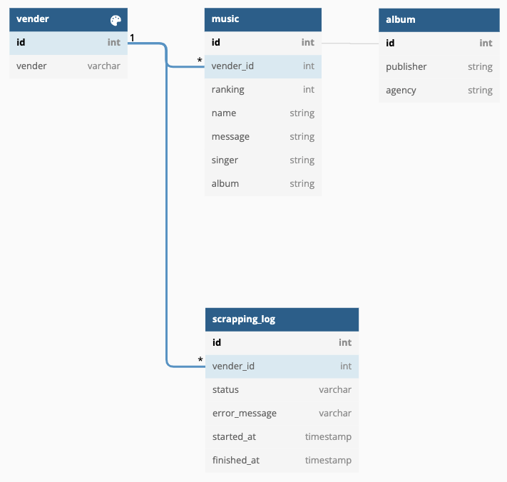
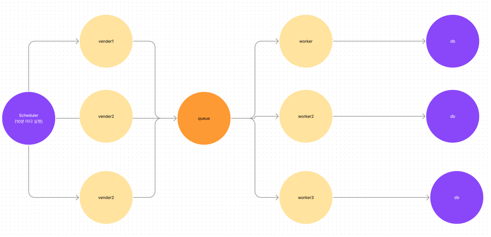

## Stack
- nodejs
- nestjs
- cheerio
- node-json-db
- docker
- swagger
- bull
- cache-manager
- redis

## Installation
1. Redis 서비스 실행
```bash
$ npm run service:up
```

2. 서비스 실행
```bash
$ npm run start:dev
```

3. 서비스 종료
```bash
$ npm run service:down
```

## Documentation
- host: localhost
- port: 3000
- docs: /api

## Description

### ERD
(실제 서비스에 사용한 데이터베이스는 json을 활용했음으로 약간의 차이가 있음)


### 스크래핑 동작 방식 청사진
비동기 큐를 활용하여 vendor들이 확장되어도 효율적인 처리를 위해 간략하게 그림을 그려보았습니다.


### 캐싱
redis + cache manager를 통해 각 음원순위 API들을 기본적으로 30분을 캐시하며
스크래핑(10분 마다 발생) 과정에서 변경이 있을 경우 cache 내용을 지워 업데이트 된 내용을 보여줍니다.

### 추가 및 수정 확장이 가능한 설계
우선 각 음원 순위 사이트들은 공통의 패턴을 갖고 있습니다.
1. 음원 순위 화면이 테이블 형태로 구성된다.
2. 각 음원 순위 테이블은 필요한 정보들이 컬럼으로 존재한다.
3. 앨범 상세 페이지가 존재한다.

이렇게 공통적인 부분을 패턴으로 만들어 스크래핑하는 코드를 추출하였습니다.
```text
{
    music: {
        url: 'https://www.genie.co.kr/chart/top200', // 음원 순위 url
        target: '.music-list-wrap table tbody tr', // 음원 테이블의 위치
        rankTarget: 'td:nth-of-type(2)', // 순위 위치
        nameTarget: 'td:nth-of-type(5) a:nth-of-type(1)', // 곡명 위치
        singerTarget: 'td:nth-of-type(5) a:nth-of-type(2)', // 가수 위치
        albumTarget: 'td:nth-of-type(5) a:nth-of-type(3)', // 앨범 위치
        albumIdTarget: 'td:nth-of-type(3)', // 앨범 ID 추출할 위치
        albumIdPrefix: 'fnViewAlbumLayer', // 앨범 ID 추출을 위한 정규식의 prefix
    },
    album: {
        url: 'https://www.genie.co.kr/detail/albumInfo?axnm=', // 앨범 상세 url
        target: '.album-detail-infos .info-data', // 상세 정보 위치
        publisherTarget: 'li:nth-of-type(3) span:nth-of-type(2)', // 발매사 위치
        agencyTarget: 'li:nth-of-type(4) span:nth-of-type(2)', // 기획사 위치
    },
}
```

우선 요구사항을 벗어나는 작업이라 판단되어 코드 상에 위 정보를 파악하여
```typescript
main.ts
vendorDatabase.create(
  VendorEnum.MELON,
  vendorInformationDictionary[VendorEnum.MELON],
);
```

위 코드를 추가하면 바로 vendor를 추가할 수 있고 수정할 수 있습니다. 

다만, 만약 추가적인 요구사항이 발생하여 내부 사용자가 UI 화면으로 CRUD를 해야한다면 
vendor 테이블을 CRUD하는 API만 만들면 요구사항을 충족시킬 수 있습니다.

### 기타 사항
- 요구사항 중 "단일 노웨 대해 동일한 api 요청이 빠르게 들어오는 경우, 처리 중인 Task의 결과를 반환할 수 있도록 구현해 주세요." 내용은 맥락을 이해하지 못해 아쉽게도 개발 내용에 포함되지 못한 것 같습니다.
- vibe라는 vendor가 존재하는데 이 페이지는 headless browser를 활용해야만 처리할 수 있을 것 같습니다. (참고1)

참고1: https://stackoverflow.com/questions/67952799/how-to-get-html-data-from-site
